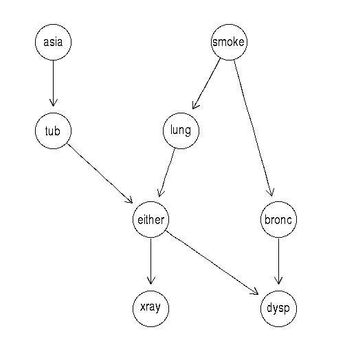

```{r setup, include=FALSE}
knitr::opts_chunk$set(echo = FALSE)
```

### 1. Show that multiple runs of the hill-climbing algorithm can return non-equivalent BN.

```{r, message=FALSE}
library(bnlearn)
library(gRain)

#########################################################################################
# (1)
data("asia")
head(asia)

# Set whitelist based on the data set documentation
wl = data.frame(from = c("A", "S", "S"), to = c("T", "L", "B"))

# BN with whitelist specified
set.seed(123456789)
BN1 <- hc(asia, whitelist = wl)

# BN without whitelist
set.seed(123456789)
BN2 <- hc(asia)

# BN with restart = 5
set.seed(123456789)
BN3 <- hc(asia, restart = 5)

# BN with aic
BN4 <- hc(asia, score = "aic")

# BN with bde, restart = 2
BN5 <- hc(asia, start = NULL, score = "bde", restart = 2)

# Starting graph
cnames <- colnames(asia)
startg <- random.graph(nodes=cnames, num=1, method="melancon")

# BN with starting graph
BN6 <- hc(asia, start = startg)

```

&nbsp;

Data set __Asia__ has two-level factor variables related to lung diseases (tuberculosis, lung cancer or bronchitis) and visits to Asia. To show that multiple runs of the hill-climbing algorithm can return non-equivalent Bayesian network(BN) structures, 6 outcome BNs from different setting of hill-climbing algorithm will be compared.

&nbsp;

- BN1: hill-climbing algorithm with a whitelist (forcing arcs A -> T, S -> L, S -> B)
- BN2: hill-climbing algorithm with no setting
- BN3: hill-climbing algorithm with random restart = 5
- BN4: hill-climbing algorithm with aic score
- BN5: hill-climbing algorithm with bde score and restarts = 2
- BN6: hill-climbing algorithm with random starting graph

&nbsp;

The whitelist is based on the documentation of the data set and the complete BN can be found in this following URL:

http://www.bnlearn.com/bnrepository/discrete-small.html#asia

{width=300px, height=225}

```{r, fig.height=9}
# Plot BNs
par(mfrow=c(3,1))
plot(BN1, main="BN1 - with whitelist")
plot(BN2, main="BN2 - with no setting ")
plot(BN3, main="BN3 - with restart=5")
plot(BN4, main="BN4 - with aic score")
plot(BN5, main="BN5 - with bde score & restart=2")
plot(startg, main="Generated Random Starting Graph")

```

```{r}
par(mfrow=c(1,1))
plot(BN6, main="BN6 - with Random Starting Graph")

```

From the graphs above, it is clear that different runs of the hill-climbing algorithm produces non-equivalent Bayesian Network structures.

By forcing 3 arcs as the whitelist indicates, the algorithm delivers BN1 which is the same as the complete BN. However, without the whitelist the algorithm yields BN2 which has one arc less than BN1. The arc A -> T is missing here. For BN3 _restart=5_ is specified and direction of one arc is changed compared to BN2 as from (S -> L) to (L -> S). 

Hill-climbing algorithm is a heuristic approach and unfortunately is not asymptotically correct. Moreover, statistically BN2 and BN3 are indistinguishable. 

\clearpage

### 2. Learn a BN from 80% of the __Asia__ dataset. 

In this question the data is split into training (80%) and testing (20%) data sets. Then a local optimal structure is found using the Hill Climbing method. Afterwards the parameters are learnt using Maximum Likelihood algorithm, and the resulting graph is compiled (the steps of moralization and triangulation are done).

```{r}

#########################################################################################
# (2)
# Divide data into training and testing sets
set.seed(12345)
n <- dim(asia)[1]
id <- sample(1:n, floor(n*0.8))
train <- asia[id,]
test <- asia[-id,]

# Train with mle method
hc_model <- hc(train)
plot(hc_model, main="BN structure with train data")
hc1 <- bn.fit(hc_model, data=train, method="mle")

# Convert bn.fit object to grain object
hc1 <- as.grain(hc1)

# Compile grain object
hc2 <- compile(hc1)

# prediction vector
pred <- c()

# prediction
for(i in 1:1000){
  z<-NULL
  for(j in c("A","T","L","B","E","X","D")){
    if(test[i,j]=="no"){
      z<-c(z,"no")
    }
    else{
      z<-c(z,"yes")
    }
  }
  hc3 <- setEvidence(hc2, nodes=c("A","T","L","B","E","X","D"), states=z)
  hc4 <- querygrain(hc3, c("S"), result = "data.frame")
  
  if(hc4[[1]][1,2] > 0.5){
    pred[i] <- "no"
  }else{
    pred[i] <- "yes"
  }
}

# Confusion matrix and Missclassification rate
conf_BN <- table(pred, test$S)
Miss_BN1 <- (conf_BN[1,2]+conf_BN[2,1])/sum(conf_BN)

list(Confusion_matrix_BN1=conf_BN)
list(Missclassification_rate_BN1=Miss_BN1)


# True model
dag = model2network("[A][S][T|A][L|S][B|S][D|B:E][E|T:L][X|E]")

tBN <- bn.fit(dag, data=train, method='mle')
tBN2 <- as.grain(tBN)
tBN3 <- compile(tBN2)

# prediction vector
tBN_pred <- c()

# prediction
for(i in 1:1000){
  z<-NULL
  for(j in c("A","T","L","B","E","X","D")){
    if(test[i,j]=="no"){
      z<-c(z,"no")
    }
    else{
      z<-c(z,"yes")
    }
  }
  tBN4 <- setEvidence(tBN3, nodes=c("A","T","L","B","E","X","D"), states=z)
  tBN5 <- querygrain(tBN4, c("S"), result = "data.frame")
  
  if(tBN5[[1]][1,2] > 0.5){
    tBN_pred[i] <- "no"
  }else{
    tBN_pred[i] <- "yes"
  }
}

# Confusion matrix and Missclassification rate
conf_tBN <- table(tBN_pred, test$S)
Miss_tBN <- (conf_tBN[1,2]+conf_tBN[2,1])/sum(conf_tBN)

list(Confusion_matrix_tBN=conf_tBN)
list(Missclassification_rate_tBN=Miss_tBN)

```

The results are exactly the same.


### 3. Markov blanket

In this question only the Markov blanket of node S is used for the predictions. That is, S' parents plus its children plus the parents of its children minus S itself.

```{r}

#########################################################################################
# (3)

# Markov blanket
mbs <- mb(hc_model, node = "S")
list(Markov_blanket=mbs)

# prediction data.frame
mb_pred <- c()

# prediction
for(i in 1:1000){
  z<-NULL
  for(j in c("L","B")){
    if(test[i,j]=="no"){
      z<-c(z,"no")
    }
    else{
      z<-c(z,"yes")
    }
  }
  hc3 <- setEvidence(hc2, nodes=c("L","B"), states=z)
  hc4 <- querygrain(hc3, c("S"), result = "data.frame")
  
  if(hc4[[1]][1,2] > 0.5){
    mb_pred[i] <- "no"
  }else{
    mb_pred[i] <- "yes"
  }
}

# Confusion matrix and Missclassification rate
conf_mb <- table(mb_pred, test$S)
Miss_mb <- (conf_mb[1,2]+conf_mb[2,1])/sum(conf_mb)

list(Confusion_matrix_MB=conf_mb)
list(Missclassification_rate_mb=Miss_mb)

```

Here, the result is the same as previous.

\clearpage


### 4. Naive Bayes classifier

Naive Bayes classifier has a graph with all arrows pointing from S towards other nodes. This indicates that the other nodes are independent from each other given the class label. The corresponding graph is plotted below:

```{r}

#########################################################################################
# (4)

# Modelling Naive Bayes as BN
NB_model <- empty.graph(colnames(asia))

# Arc setting
arc.set <- matrix(c("S", "A", "S", "T", "S", "L",
                   "S", "B", "S", "E", "S", "X", "S", "D"),
             ncol = 2, byrow = TRUE,
             dimnames = list(NULL, c("from", "to")))

arcs(NB_model) <- arc.set

plot(NB_model, main="Naive  Bayes graphical model")


# Train with mle method
NB1 <- bn.fit(NB_model, data=train, method="mle")

# Convert bn.fit object to grain object
NB1 <- as.grain(NB1)

# Compile grain object
NB2 <- compile(NB1)

# prediction data.frame
NB_pred <- c()

# prediction
for(i in 1:1000){
  z<-NULL
  for(j in c("A","T","L","B","E","X","D")){
    if(test[i,j]=="no"){
      z<-c(z,"no")
    }
    else{
      z<-c(z,"yes")
    }
  }
  NB3 <- setEvidence(NB2, nodes=c("A","T","L","B","E","X","D"), states=z)
  NB4 <- querygrain(NB3, c("S"), result = "data.frame")
  
  if(NB4[[1]][1,2] > 0.5){
    NB_pred[i] <- "no"
  }else{
    NB_pred[i] <- "yes"
  }
}

# Confusion matrix and Missclassification rate
conf_NB <- table(NB_pred, test$S)
Miss_NB <- (conf_NB[1,2]+conf_NB[2,1])/sum(conf_NB)

list(Confusion_matrix_NB=conf_NB)
list(Missclassification_rate_NB=Miss_NB)
```

The Naive Bayes Classifier produced slightly worse results.

\clearpage


### 5. Explain why you obtain the same or different results in the exercises (2-4).

The true BN and the trained BN in Question 2 have the same Markov blanket and therefore their predictions are the same. The only difference between the two BNs is that the true BN has an arc between $A$ and $T$, but these nodes are not directly linked to $S$. The results in Question 3 are the same as in Question 2 because the Markov blanket is the same for the trained BN and the true graph and there are no other nodes connected to $S$ and so those nodes do not add any more information to our prediction.

The Naive-Bayes classifier in Question 4 performed worse than the networks in Questions 2 and 3. That may be due to the fact that the other nodes are not connected: some information between them is lost. The assumption that the variables are independent given the class label may not hold (it is a naive assumption). This is the only case when the Markov blanket of $S$ is different. 

\clearpage

### Appendix

```{r, ref.label=knitr::all_labels(), echo=TRUE, eval=FALSE}

```

